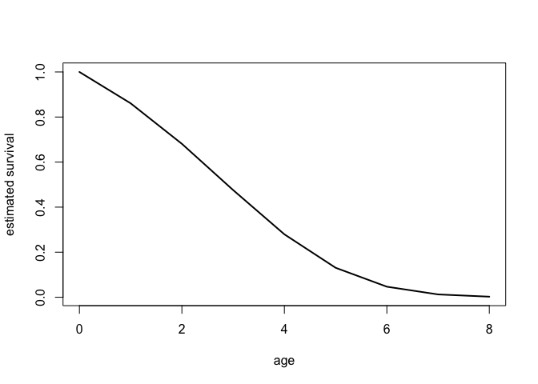
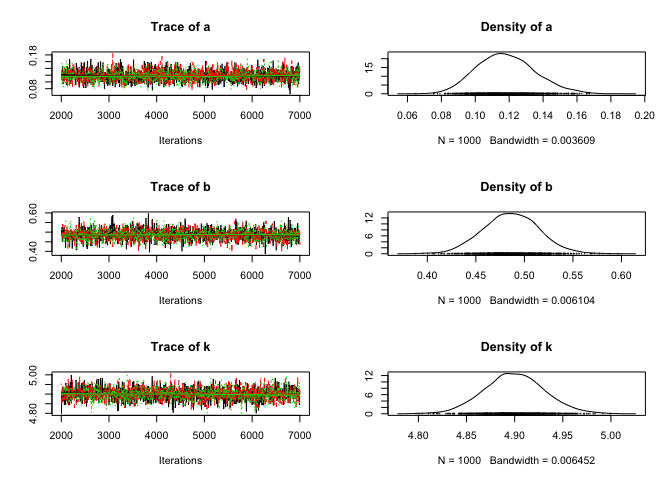
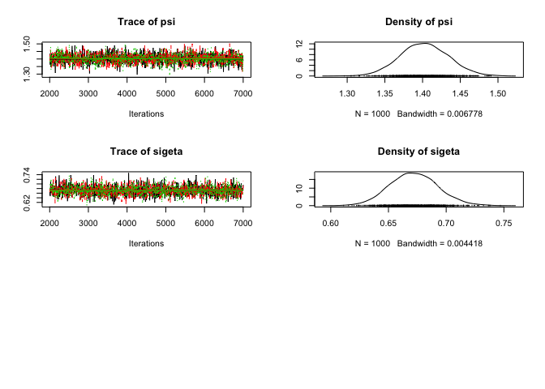
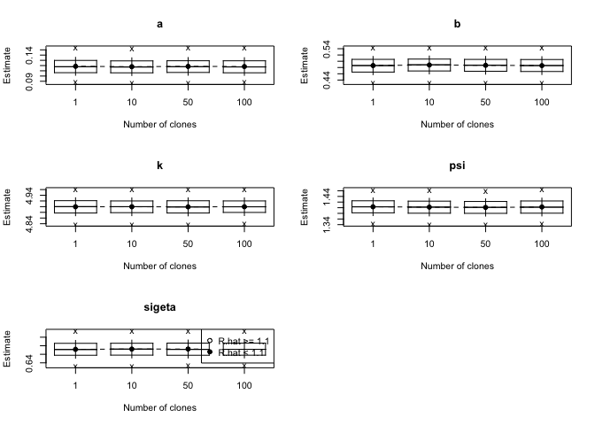
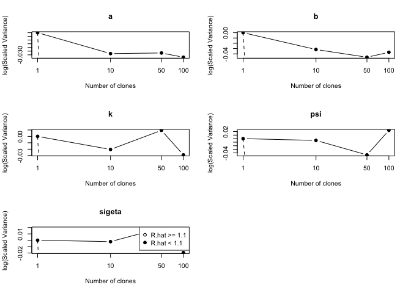

# In brief
  
`GammaGompertzCR` is an R package that allows estimating survival in free-ranging animal populations using a Gompertz capture-recapture model with a Gamma frailty to deal with individual heterogeneity. It uses data cloning in the Bayesian framework to get maximum likelihood parameter estimates (Lele et al. 2007). Data cloning uses multiple copies of the data to produce prior-invariant inferences and a normal distribution centered at the maximum likelihood estimates. In addition, this method allows detecting non-identifiable parameters (Lele et al. 2010). To use the package, users should be familiar with Bayesian MCMC techniques and in particular how to interpret convergence diagnostics. We refer to Robert and Casella (2010) for an introduction to Bayesian MCMC techniques with R and to King et al. (2009) for an introduction for ecologists.

# Installation

This repository hosts the development version of the package. Assuming `JAGS` is already on your system (otherwise it'll take a minute to [get it](http://mcmc-jags.sourceforge.net/), you can install `GammaGompertzCR` as follows:

```r
if(!require(devtools)) install.packages("devtools")
library("devtools")
install_github('oliviergimenez/GammaGompertzCR')
```

# Getting help, reporting an issue or contribute

To report bugs/issues/feature requests, please file an [issue](https://github.com/oliviergimenez/GammaGompertzCR/issues). These are very welcome!

Feel free to contribute to the repository by forking and submitting a pull request. If you are new to GitHub, you might start with a [basic tutorial](https://help.github.com/articles/set-up-git) and check out [a more detailed guide to pull requests](https://help.github.com/articles/about-pull-requests/).

If you prefer to email, feel free to drop a message to the Gilbert and Olivier (see the DESCRIPTION file of this repository for their contact details).

# A session example

## Preliminary steps

First, we need to load the package:

```r
library(GammaGompertzCR)
```

Then, we read in some data. Below we use a fragment of the dipper dataset `dipper_tiny` used by Marzolin et al. (2011) and provided with the package. The complete dataset `dipper_complete` is also provided. Detections are the 1's, non-detections the 2's.

```r
data(dipper_tiny)
head(dipper_tiny)
```

```
##      [,1] [,2] [,3] [,4] [,5] [,6] [,7] [,8] [,9]
## [1,]    1    1    1    1    1    1    1    1    2
## [2,]    1    1    1    1    1    1    1    2    2
## [3,]    1    1    1    1    1    1    2    2    2
## [4,]    1    1    1    1    1    2    2    2    2
## [5,]    1    1    1    2    2    2    2    2    2
## [6,]    1    1    1    2    2    2    2    2    2
```

## Model fitting

Now let's fit the Gamma-Gompertz model to these capture-recapture data:

```r
clo = c(1,10,50,100) # numbers of clones
nu = 1000 # number of updates
ni = 5000 # number of iterations
nt = 5 # thinning
nc = 3 # number of chains
initmeans = c(0.15,0.5,4.9,1.4,-0.4) # means of normally distributed priors for parameters
initprec = 1000 # common precision of the normal priors for the first number of clones

# fitting procedure (this may take a few minutes)
post_inf = fit_ggcr(dipper_tiny,clo,nu,ni,nt,nc,initmeans,initprec)
```

```
## 
## Parallel computation in progress
## 
## 
## Parallel computation in progress
## 
## 
## Parallel computation in progress
## 
## 
## Parallel computation in progress
```

Let's display the parameter estimates from posterior distributions :      

```r
summary(post_inf[[length(clo)]])
```

```
## 
## Iterations = 2005:7000
## Thinning interval = 5 
## Number of chains = 3 
## Sample size per chain = 1000 
## Number of clones = 100
## 
## 1. Empirical mean and standard deviation for each variable,
##    plus standard error of the mean:
## 
##          Mean      SD  DC SD  Naive SE Time-series SE  R hat
## a      0.1184 0.01726 0.1726 0.0003151      0.0003410 1.0021
## b      0.4858 0.02774 0.2774 0.0005065      0.0005065 1.0019
## k      4.9005 0.03196 0.3196 0.0005835      0.0005836 0.9997
## psi    1.4030 0.03158 0.3158 0.0005765      0.0005666 1.0003
## sigeta 0.6720 0.02096 0.2096 0.0003826      0.0004017 1.0027
## 
## 2. Quantiles for each variable:
## 
##           2.5%    25%    50%    75%  97.5%
## a      0.08774 0.1066 0.1176 0.1295 0.1539
## b      0.43299 0.4670 0.4854 0.5042 0.5401
## k      4.84050 4.8774 4.9002 4.9230 4.9622
## psi    1.34053 1.3818 1.4038 1.4234 1.4657
## sigeta 0.63229 0.6578 0.6719 0.6859 0.7142
```

Let's represent survival as a function of age at the population level. 


```r
# get values from posterior distributions
a<- coef(post_inf[[length(clo)]])[1]
b<- coef(post_inf[[length(clo)]])[2] 
k<- coef(post_inf[[length(clo)]])[3]
grid_age = seq(0,8,1)
S = exp(-k*log(1+(exp(b*grid_age)-1)*a/(b*k)))
plot(grid_age,S,xlab='age',ylab='estimated survival',lwd=2,type='l')
```

<!-- -->

## Convergence diagnostics

First have a look at the traceplots for all parameter estimates got with the last (ascending order) number of clones:

```r
plot(post_inf[[length(clo)]], ask = FALSE)
```

<!-- --><!-- -->

Now checking some correlations:

```r
coda::autocorr.diag(post_inf[[length(clo)]])    
```

```
##                  a           b            k          psi       sigeta
## Lag 0   1.00000000 1.000000000  1.000000000  1.000000000  1.000000000
## Lag 5   0.04511053 0.006199508  0.003305411 -0.032707078  0.025391909
## Lag 25  0.01532144 0.032783320 -0.021123985 -0.007077515 -0.019410382
## Lag 50  0.01916528 0.017745286 -0.008175271  0.005684847  0.006116532
## Lag 250 0.00432125 0.001832669 -0.005983787  0.018575564  0.003437716
```

```r
coda::crosscorr.plot(post_inf[[length(clo)]]) 
```

<!-- -->

```r
coda::gelman.diag(post_inf[[length(clo)]])
```

```
## Potential scale reduction factors:
## 
##        Point est. Upper C.I.
## a               1       1.01
## b               1       1.01
## k               1       1.00
## psi             1       1.00
## sigeta          1       1.01
## 
## Multivariate psrf
## 
## 1
```

Parameters $a$ and $b$ seem to be slightly auto- and cross-correlated. 

## Sensitivity to priors

It is good advice to check if changing the priors leads to similar posterior results. In our case, the choice of `initmeans` is made through trial and error, because the models we're dealing with have likelihood with multiple spikes. For instance, we might begin with vague priors: `initmeans = c(1,1,5,2,-0.5), initprec=10, clo= c(1,50,100)`, which yields `c(0.11,0.51,4.39,1.44,0.41)` with quite large standard deviation. Modifying the prior means can affect the posterior estimates. Hence, additional tests are required. For each number of clones, the posterior variances of the parameters are divided by that obtained with `min(clo)` to get scaled variances. When increasing the number of clones, the means of the parameters converge to the maximum likelihood estimates while their scaled variances decrease to reach a lower bound. We get a visual threshold indicating the minimal number of clones to agree with
the desired results (Solymos 2010) by plotting the scaled variances or their logs against the number of clones.

First, create a list by hand or via a few lines of code when there are several lots of clones: `post_inf[[1]], ..., post_inf[[length(clo)]]`. Say we have 4 lots of clones:

```r
clo = c(1,10,50,100) 
lu = NULL   
for (i in 1:length(clo)) lu = c(lu,paste(c("post_inf[[",i,"]],"),sep="",collapse=""))
lu
```

```
## [1] "post_inf[[1]]," "post_inf[[2]]," "post_inf[[3]]," "post_inf[[4]],"
```

Second, use function `dct` to do the job:

```r
dct <- dclone::dctable(post_inf[[1]],post_inf[[2]],post_inf[[3]],post_inf[[4]]) 
plot(dct)        
```

<!-- -->

```r
#log of scaled variances against number of clones.
plot(dct, type= "log.var")  
```

<!-- -->

## Checking parameter identifiability

Data cloning allows testing identifiability rather easily (Lele 2010). When some parameters are not estimable, the largest eigenvalue of the posterior covariance matrix `lambda.max` does not tend to 0. When it tends to 0, the parameters are estimable and the results are independent of prior choice. Two other statistics `ms.error` and `r.squared` are used to test the normality of the limit. Notice that the statistical accuracy is a function of the sample size but not of the number of cloned copies (Lele et al.2010). 

Get the necessary elements and checking:


```r
u<-v<-w<-x<-y<-numeric(0)
for (i in 1:length(clo)){
  u[i]<-clo[i]
  v[i]<-dclone::dcdiag(post_inf[[i]])$lambda.max
  w[i]<-dclone::dcdiag(post_inf[[i]])$ms.error
  x[i]<-dclone::dcdiag(post_inf[[i]])$r.squared
  y[i]<-dclone::dcdiag(post_inf[[i]])$r.hat
}
mat.dcdiag <- matrix(c(u,v,w,x,y),c(length(clo),5)) 
dimnames(mat.dcdiag)= list(NULL,c("clones","lambda.max","ms.error","r.squared","r.hat"))               
mat.dcdiag
```

```
##      clones  lambda.max    ms.error    r.squared    r.hat
## [1,]      1 0.000980802 0.004248469 0.0002099880 1.004150
## [2,]     10 0.001058182 0.007496436 0.0007495406 1.000316
## [3,]     50 0.001041817 0.049345784 0.0044756094 1.002521
## [4,]    100 0.001031733 0.016930053 0.0015876053 1.004819
```

# References

King R, Morgan BJT, Gimenez O and Brooks S (2009). Bayesian Analysis for Population Ecology. Chapman & Hall/CRC Interdisciplinary Statistics.

Lele, SR, D Dennis, and F Lutscher. 2007. Data Cloning: Easy Maximum Likelihood Estimation for Complex Ecological Models Using Bayesian Markov Chain Monte Carlo Methods. Ecology Letters 10: 551–63.

Lele, SR, K Nadeem, and B Schmuland. 2010. Estimability and Likelihood Inference for Generalized Linear Mixed Models Using Data Cloning. Journal of the American Statistical Association 105: 1617–25.

Marzolin, G, A Charmantier, and O Gimenez. 2011. Frailty in State-Space Models: Application to Actuarial Senescence in the Dipper. Ecology 92: 562–67.

Missov, TI. 2013. Gamma-Gompertz Life Expectancy at Birth. Demographic Research 28: 259–270.

R Core Team. 2016. R: A Language and Environment for Statistical Computing. Vienna, Austria: R Foundation for Statistical Computing. http://www.R-project.org/.

Robert CP and Casella G (2010). Introducing Monte Carlo Methods with R. Springer.

Solymos, P. 2010. dclone: Data Cloning in R. The R Journal 2: 29-37.


